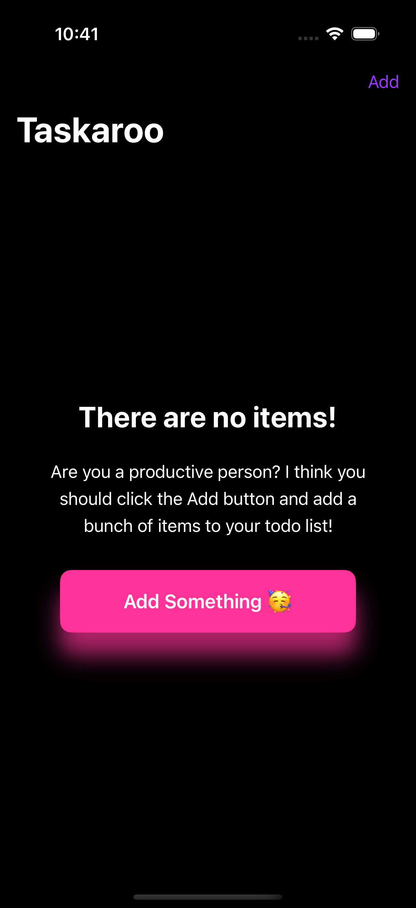
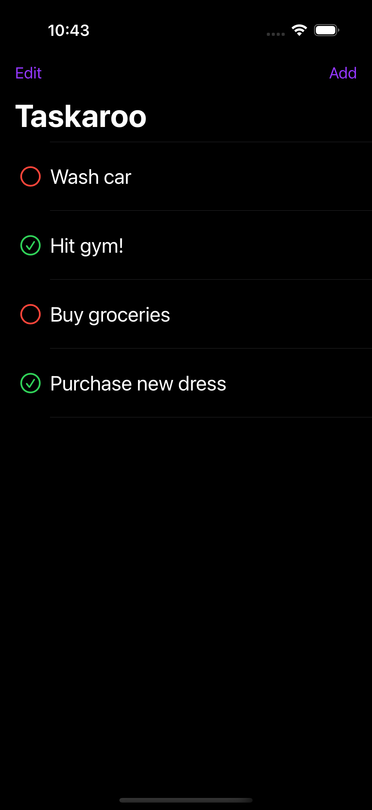
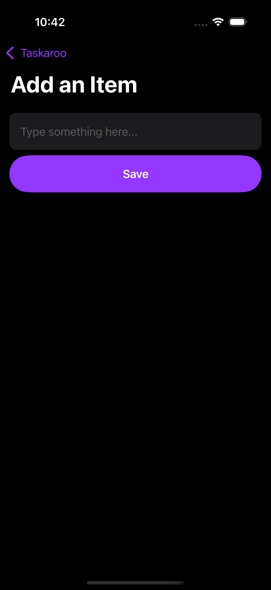
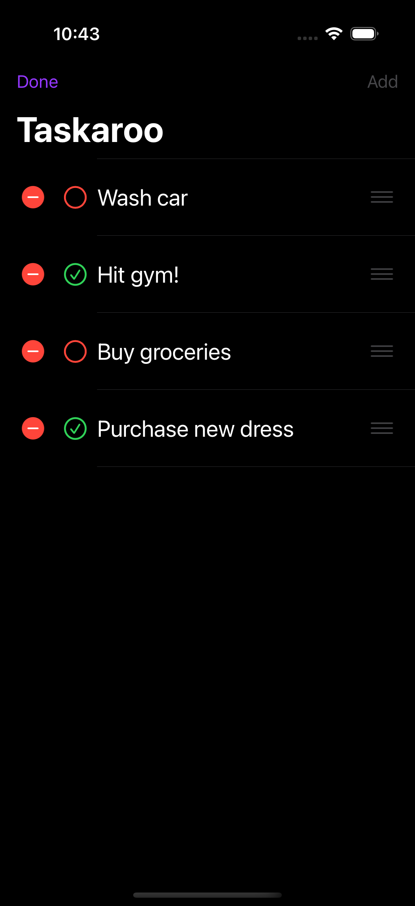

# 📝 Taskaroo

**Taskaroo** is a clean and minimal To-Do List app built with **Swift** and **SwiftUI**. It lets you add, update, and manage tasks with ease — with smooth animations and native support for both **light** and **dark** modes.

---

## ✨ Features

- ✅ Add new tasks
- 👁️ View a list of all tasks
- 🔁 Toggle task completion status
- 🗑️ Delete tasks
- 🎨 Beautiful SwiftUI animations
- 🌗 Light & Dark Mode support
- 💾 Data is stored locally using `UserDefaults`

---

## 🛠 Tech Stack

- **Swift 5**
- **SwiftUI**
- **UserDefaults** (for local persistence)

---

## 📸 Screenshots

